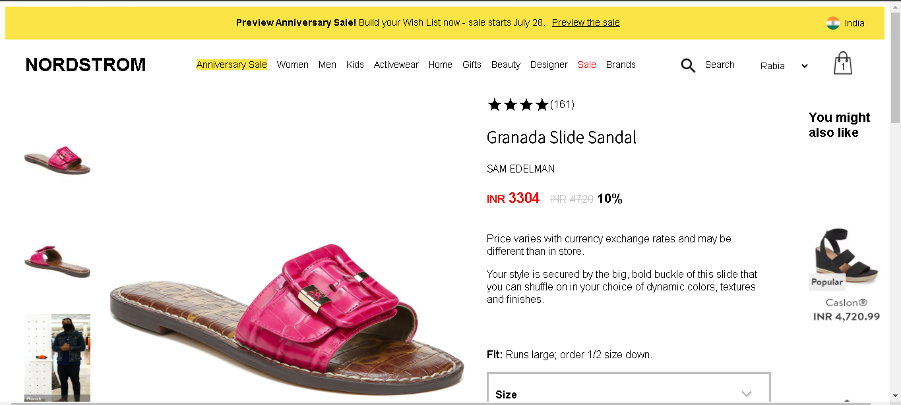

# Nordstrom Clone
As a part of our build week we were given a problem statement to clone the website Nordstrom. We have tried to make a pixel-perfect clone of the original website in 6 days.

## Team Size
4

## Team Members
1. Neeraj Malwal
2. Rabia Basari
3. Robby Dongre
4. Sumit Kumar

## About Project
Nordstrom is an international Online Shopping Store. Founded in 1901 by John W. Nordstrom and Carl F. Wallin, it originated as a shoe store and evolved into a full-line retailer with departments for clothing, footwear, handbags, jewelry, accessories, cosmetics, and fragrances. As of 2021, Nordstrom operates 100 stores in 32 U.S. states, and three Canadian provinces since entering the market in 2014. One location in Puerto Rico was in operation from 2015 through 2020. We have tried to build the perfect clone of the website.

## Build With
* HTML5
* CSS3
* JavaScript

## Pre-requisites
#### Clone the repo:
        git clone repo_link
#### Create branches 
        git checkout -b branch_name
#### Adding the files:
        git add filename
#### Commiting the changes:
        git commit -m "description"
#### Pushing the commits: 
        git push origin branch_name
#### Pulling the changes 
        git pull origin branch_name
  
## Core Functionalities
* Login/Signup
* Product Page
* Sorting the products as per prices
* Filter the products by brand
* Zooming in the product
* Add to cart
* Remove the product from cart
* Checkout

# Quick Tour to our Project
1. This is the langing page of our website.

2. This the shop by category page where the user can find all the products related to any particular category like men's category or women's category.

3. In the Product page, the user can see all the details of any particular product he/she selects and there the user can select the size, color or any of the specifications depending on the requirement and add the product in to the shopping bag.

4. After adding products to the bag, the user can go to the checkout page , where he can see all the prodcuts that are added to the bag and the order summary that include the total cost of the products.

5. This is the payment gateway where the user has to provide the card details and make the payment and place the order.

6. Once the payment is done and the order is successfully placed and it will redirect to the payment process page and after 3 seconds it will redirect the user to the home page of the website.

